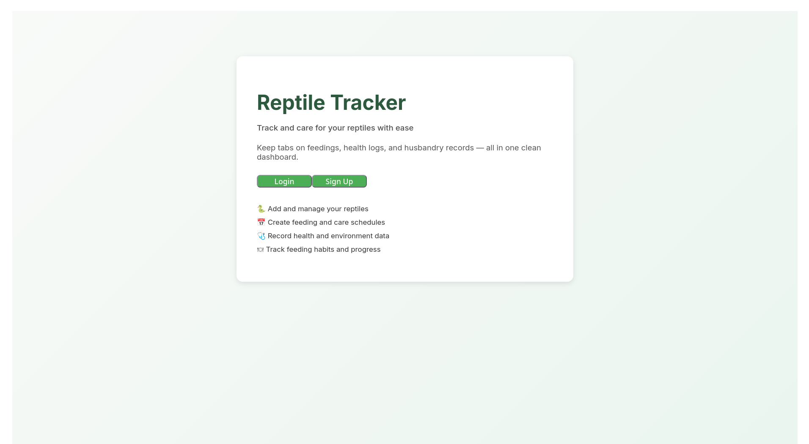
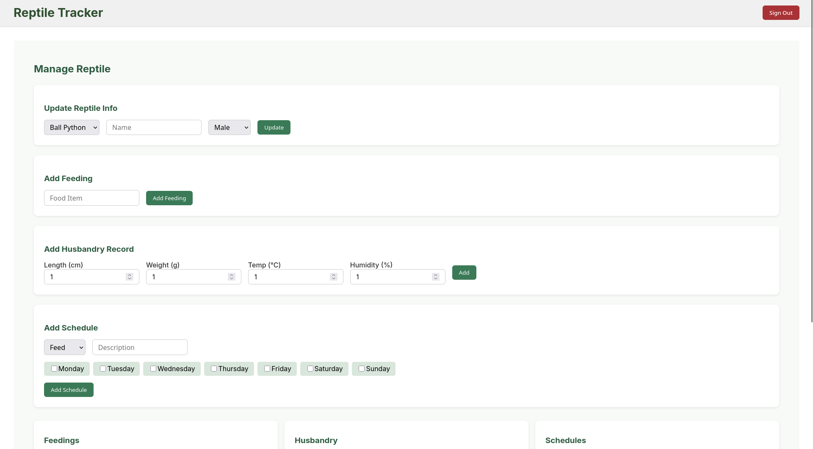
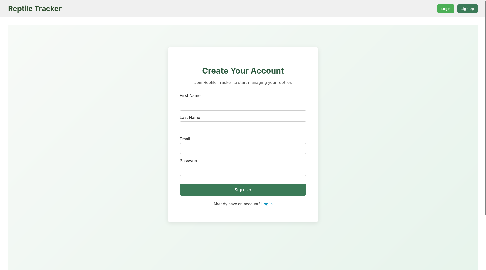

# 🦎 Reptile Tracker

Reptile Tracker is a web application designed to help reptile owners efficiently manage their pets' schedules, husbandry, feedings, and more. It provides a user-friendly interface for managing reptiles, tracking their care, and creating structured schedules.

## 📸 Screenshots

### Landing Page
This is page you encounter when you first launch the website. It will prompt you to log in or to sign up.


### Dashboard Page
The dashboard page provides an overview of your reptiles and quick access to their details and records.


### Edit Reptile Page
Easily update your reptile's details, such as name, species, and sex, through the Edit Reptile page.


### Signup Page
The user is able to create an account and login to their personal account. Their personal data is persisted to the database.



## 🎯 Features

### User Management
- Create and manage user accounts.
- Log in securely to access personal reptile data.

### Reptile Management
- Add, update, delete, and list reptiles.
- Track species and specific traits like name and sex.

### Feeding Records
- Log feedings with food items for each reptile.
- View feeding history to ensure proper care.

### Husbandry Records
- Record and track key metrics such as length, weight, temperature, and humidity.
- Maintain historical records for each reptile's health and growth.

### Scheduling
- Create care schedules for feeding, cleaning, and record-keeping.
- View schedules for individual reptiles or all reptiles at once.

## 🧠 Tech Stack

**Frontend**  
- [Next.js](https://nextjs.org/) — React-based framework for routing and rendering.  

**Backend**  
- [Express.js](https://expressjs.com/) — Node.js framework powering the REST API.

## 🚀 Getting Started

### Prerequisites
Ensure you have `yarn` installed on your machine.

### Backend Setup
1. Navigate to the `Reptile Tracker` backend directory.
2. Run the following commands:
   ```bash
   yarn
   yarn db:migrate
   yarn dev
3. The backend server will start on `localhost:8000`.

### Frontend Setup
1. Navigate to the `client` directory.
2. Start the frontend server:
   ```bash
   yarn dev
3. You will be prompted to navigate to a specific URL (e.g., http://localhost:5174/).
