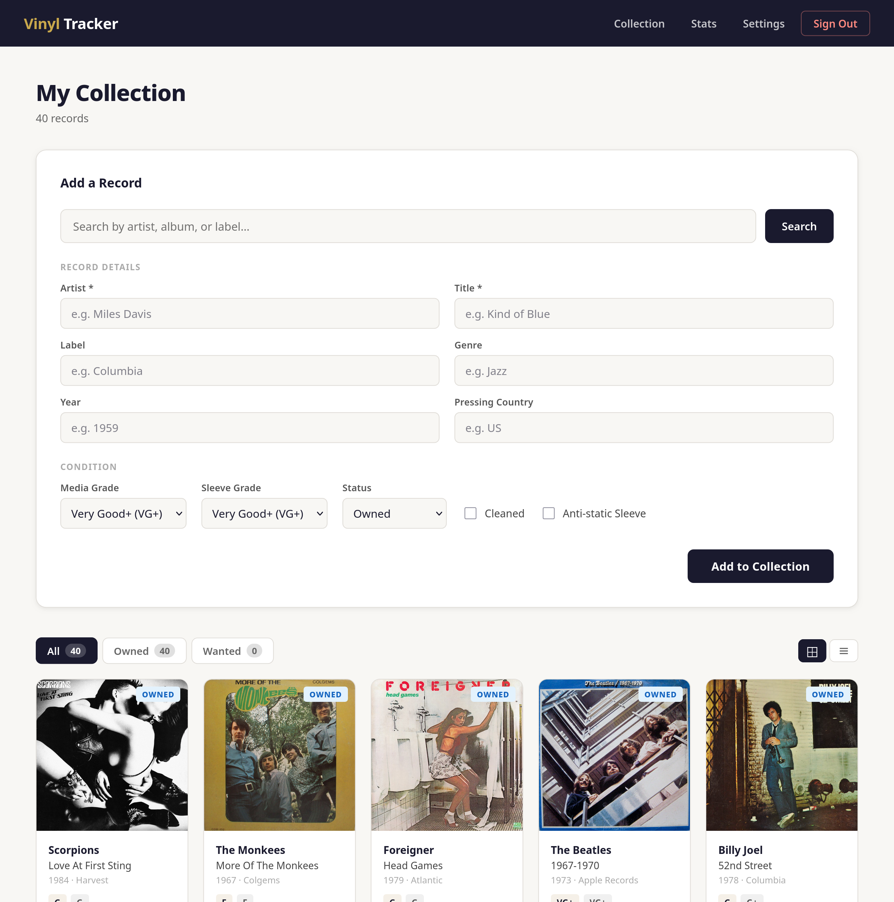
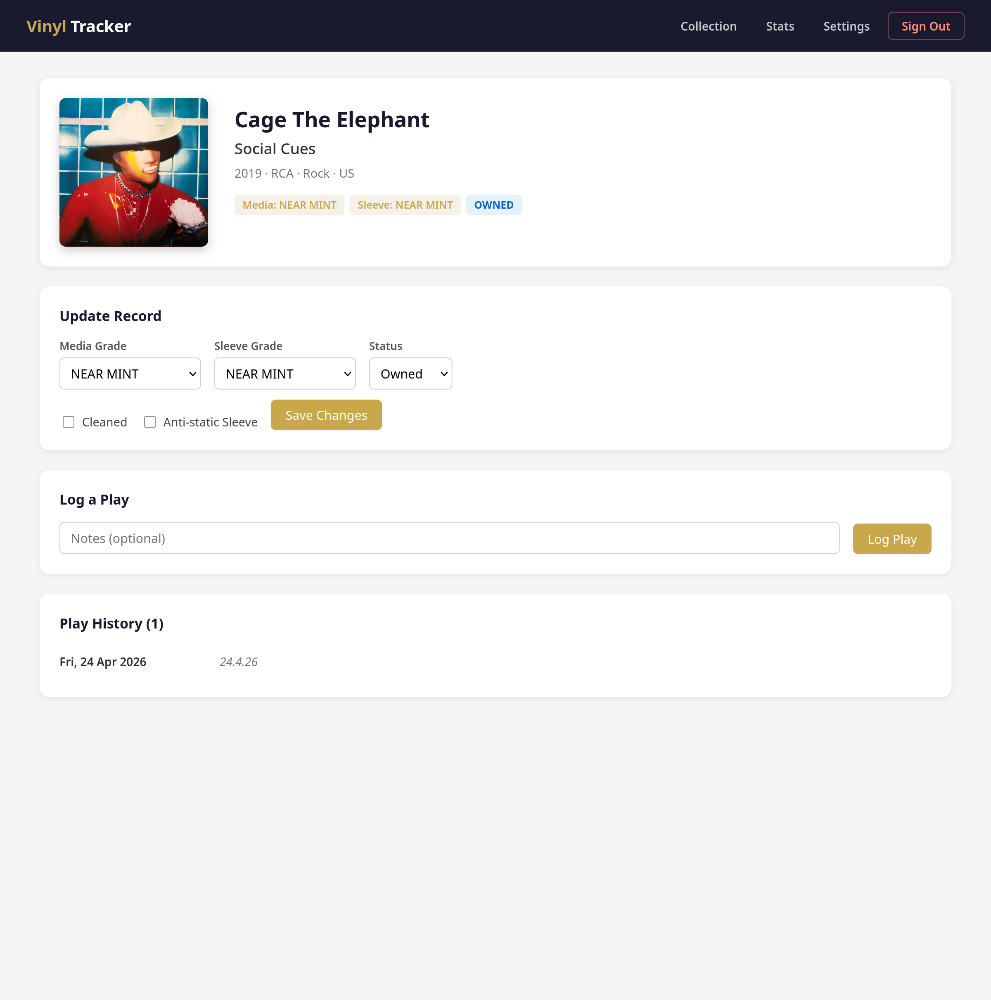
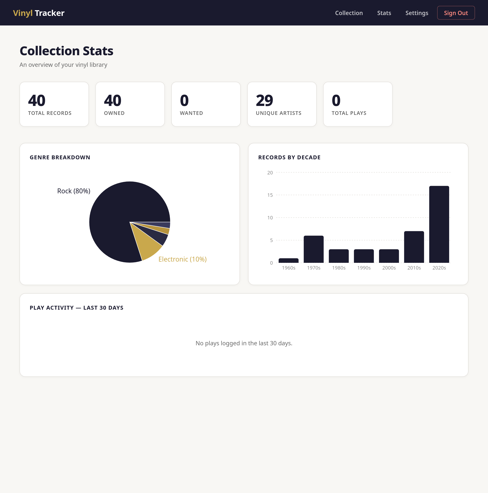
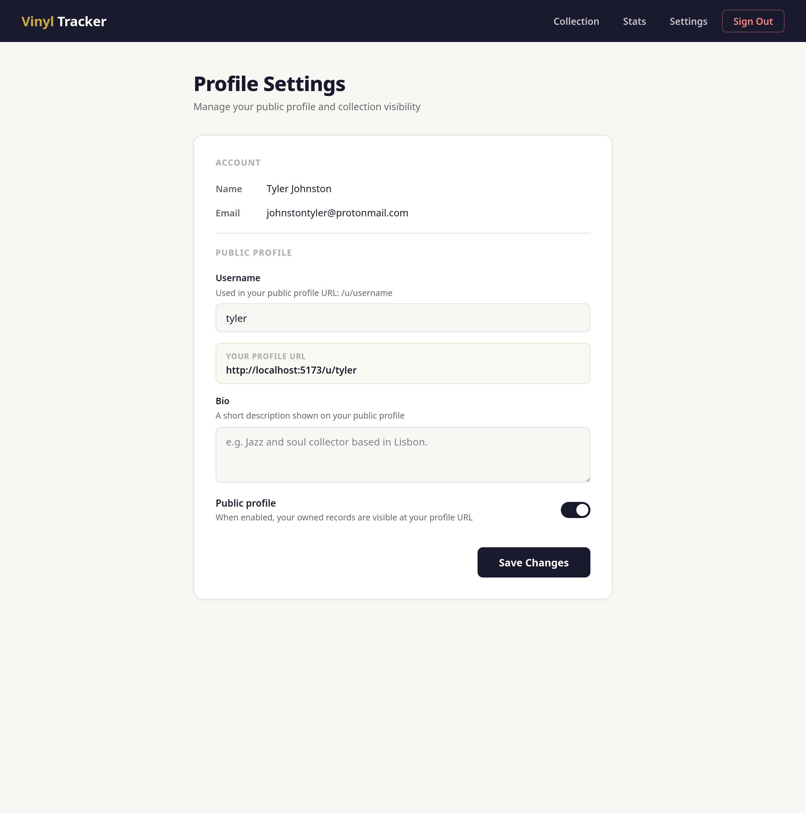

# Vinyl Tracker

A full-stack vinyl record collection manager. Search the Discogs catalogue to auto-populate records, grade using the Goldmine standard, log plays, analyse your library with charts, and share a public profile.


---

## Features

- **Discogs search** — search the full Discogs catalogue and auto-fill artist, title, year, label, genre, cover art, and pressing country
- **Goldmine grading** — grade media and sleeve independently using the industry-standard Goldmine scale (Mint → Poor)
- **Owned / Wanted** — tag records as owned or on your want list; filter the collection by status
- **Grid & table views** — switch between an album-art card grid and a compact spreadsheet view
- **Play logging** — log every time you spin a record with optional notes
- **BI dashboard** — KPI cards (total records, unique artists, total plays), genre pie chart, decade bar chart, 30-day play activity graph
- **Public profiles** — set a username, write a bio, and toggle a shareable public profile at `/u/<username>` showing your owned records
- **Session auth** — cookie-based sessions with bcrypt password hashing

---

## Screenshots

### Dashboard — collection grid


### Album art grid


### Record detail & play log


### Stats dashboard


### Public profile


### Profile settings


---

## Tech Stack

**Backend**
- Node.js + Express
- Prisma ORM (SQLite)
- bcrypt + cookie-based sessions
- Discogs REST API (proxied server-side to protect the token)

**Frontend**
- React 18 + TypeScript
- Vite
- React Router v6
- Recharts

---

## Getting Started

### Prerequisites

- Node.js 18+
- Yarn
- A free [Discogs developer token](https://www.discogs.com/settings/developers)

### 1. Clone and install

```bash
git clone https://github.com/YOUR_USERNAME/vinyl-tracker.git
cd vinyl-tracker

# Backend dependencies
yarn install

# Frontend dependencies
cd client && yarn install && cd ..
```

### 2. Configure environment

Create `.env` in the project root:

```env
DATABASE_URL="file:./dev.db"
PORT=8000
CLIENT_ORIGIN=http://localhost:5173
DISCOGS_TOKEN=your_discogs_token_here
```

### 3. Set up the database

```bash
./node_modules/.bin/prisma db push
```

### 4. Run

Open two terminals:

```bash
# Terminal 1 — backend (project root)
yarn dev

# Terminal 2 — frontend
cd client && yarn dev
```

Open [http://localhost:5173](http://localhost:5173), create an account, and start adding records.

---

## Project Structure

```
vinyl-tracker/
├── prisma/
│   └── schema.prisma              # User, VinylRecord, PlayLog, Session
├── src/
│   ├── controllers/
│   │   ├── users_controller.ts    # Auth, public profiles, settings
│   │   ├── records_controller.ts  # Collection CRUD + stats aggregation
│   │   ├── play_log_controller.ts # Play history
│   │   └── discogs_controller.ts  # Discogs API proxy
│   ├── lib/
│   │   └── controller.ts          # Route factory with auth middleware
│   └── index.ts                   # Express entry, CORS, session routes
└── client/src/
    └── pages/
        ├── Home.tsx       # Landing page
        ├── Dashboard.tsx  # Collection + add record
        ├── Record.tsx     # Record detail + play log
        ├── Stats.tsx      # BI charts
        ├── Settings.tsx   # Profile settings
        └── Profile.tsx    # Public /u/:username profile
```

---

## API Reference

| Method | Endpoint | Auth | Description |
|--------|----------|------|-------------|
| `POST` | `/users` | — | Register |
| `GET` | `/users/me` | ✓ | Current user |
| `PUT` | `/users/me` | ✓ | Update username / bio / public toggle |
| `GET` | `/users/profile/:username` | — | Public profile + owned records |
| `POST` | `/sessions` | — | Log in |
| `POST` | `/logout` | — | Log out |
| `GET` | `/records` | ✓ | All records for current user |
| `POST` | `/records` | ✓ | Add record |
| `GET` | `/records/stats` | ✓ | Aggregated stats for charts |
| `GET` | `/records/:id` | ✓ | Single record |
| `PUT` | `/records/:id` | ✓ | Update grade / status / flags |
| `DELETE` | `/records/:id` | ✓ | Remove from collection |
| `GET` | `/play-log/:recordId` | ✓ | Play history for a record |
| `POST` | `/play-log/:recordId` | ✓ | Log a play |
| `GET` | `/discogs/search?q=` | ✓ | Proxied Discogs search |
